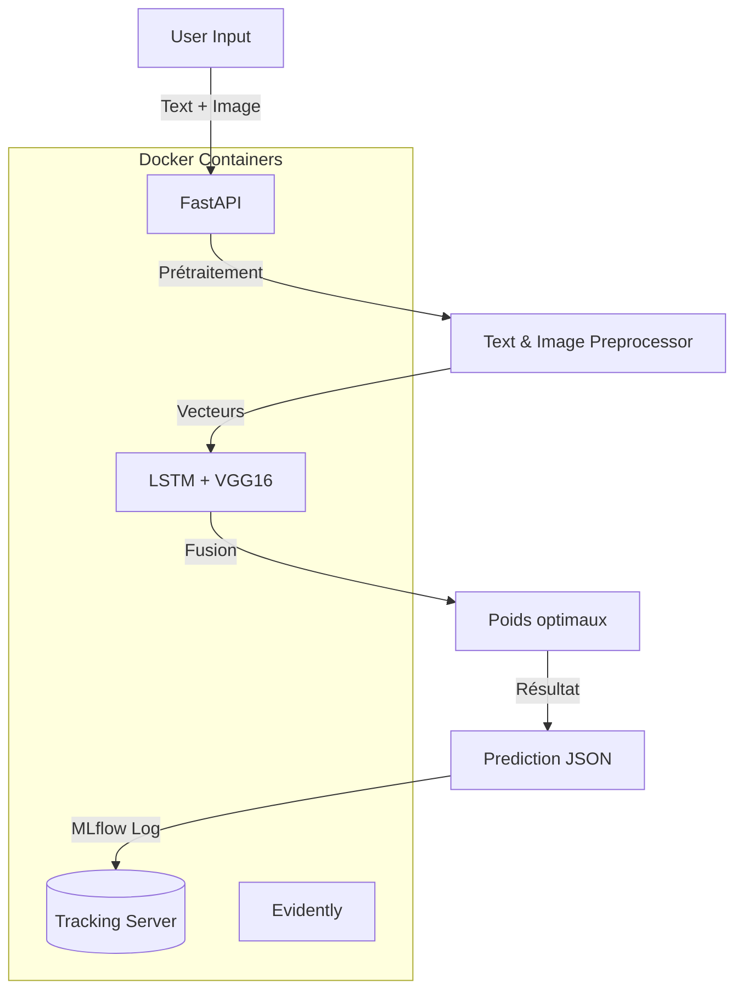

# Rakuten MLOps Project

Ce projet est une base complète pour mettre en place un pipeline MLOps moderne appliqué à une tâche de classification de produits e-commerce. Il inclut l'entraînement de modèles, la prédiction, la surveillance des dérives de données, l'orchestration et l'exposition via une API.

---

## 🔧 Installation rapide (en local)

```bash
conda create -n Rakuten-project python=3.9
conda activate Rakuten-project
pip install -r requirements.txt
```

---

## 🐳 Lancer toute la stack avec Docker

```bash
docker-compose up --build
```

ou pour lancer un composant spécifique :

```bash
docker-compose run --rm monitor
docker-compose run --rm api-fast
```

---

## ⚙️ Commandes Makefile disponibles

```bash
make train             # Entraînement depuis Dockerfile.dev
make predict           # Lancement de la prédiction (via conteneur api-fast)
make monitor           # Génère les rapports de dérive
make api               # Lance l'API en standalone
make dashboard         # Affiche le dashboard CLI de monitoring
make full-run          # Entraînement + prédiction + monitoring + dashboard
make full-run-api      # full-run + lancement de l'API
make no-train-run      # Prédiction + monitoring + dashboard (sans entraînement)
make up / make down    # Démarrer / arrêter tous les conteneurs
make lint / format     # Qualité de code
```

---

## 🧱 Structure du projet

```
├── data/
│   ├── raw/                  <- Données brutes (images + fichiers .csv)
│   ├── preprocessed/         <- Données transformées pour les modèles
│   ├── current.csv / reference.csv <- Pour le monitoring de dérive
│
├── models/                   <- Modèles entraînés (Pickle, JSON, etc.)
├── logs/                     <- Logs d'entraînement et logs API
├── notebooks/                <- Analyses exploratoires et prototypes
├── monitoring/               <- Evidently : dérive des données
│   ├── monitor.py
│   └── reports/
│
├── src/
│   ├── main.py               <- Entraînement
│   ├── predict.py            <- Prédiction
│   ├── data/                 <- Scripts d'import/preprocessing
│   ├── features/             <- Feature engineering
│   ├── models/               <- Architecture LSTM + VGG16
│   └── config/               <- Paramètres
│
├── tests/                    <- Tests unitaires
├── Dockerfile*               <- Dockerisation des services
├── docker-compose.yml        <- Orchestration multi-container
├── requirements.txt          <- Dépendances Python
├── Makefile                  <- Automatisation des tâches
└── README.md                 <- Tu y es !
```

---

## 📊 Architecture du projet (Mermaid)



---

## 🚀 Étapes principales (manuelles)

```bash
# 1. Import des données
python src/data/import_raw_data.py

# 2. Préparation du dataset
python src/data/make_dataset.py data/raw data/preprocessed

# 3. Entraînement
python src/main.py

# 4. Prédiction
python src/predict.py --dataset_path "data/preprocessed/X_test_update.csv" --images_path "data/preprocessed/image_test"

# 5. Monitoring avec Evidently
docker-compose run --rm monitor
```

Les prédictions sont sauvegardées dans `data/preprocessed/predictions.json`.

---

## 🌐 API d’inférence (FastAPI)

L’API permet de soumettre des données (JSON) pour obtenir des prédictions :

```bash
docker-compose run --rm api-fast
```

- Endpoint : `POST /predict`
- Format attendu :
```json
{
  "description": "Chaussures en cuir pour homme",
  "image": "<base64 ou chemin local>"
}
```

- Réponse :
```json
{
  "predicted_category": "263",
  "category_id": 263,
  "confidence": 0.87
}
```

Accessible sur [http://localhost:8000](http://localhost:8000)

---

## 📊 Monitoring avec Evidently

Deux rapports sont générés automatiquement :

- `monitoring/reports/drift_report.html`
- `monitoring/reports/drift_report.json`

Ces fichiers comparent `reference.csv` (ancien jeu) et `current.csv` (nouveau jeu) pour détecter toute dérive de données.

---

## 🛰️ Orchestration (Flyte)

Flyte est utilisé pour orchestrer les étapes du pipeline ML :

```bash
flytectl demo start          # Lancement du cluster Flyte en local
pyflyte run workflows/pipeline.py my_workflow
```

> Flyte offre une exécution distribuée, un tracking natif et une meilleure résilience que Airflow pour les projets MLOps.

---

## 📈 Suivi des expériences avec MLflow

Le serveur MLflow est déjà intégré via Docker et enregistre automatiquement :

- Les hyperparamètres
- Les performances (accuracy, loss, etc.)
- Les modèles (`.pth`)
- Les métriques de l’API (via endpoint `/predict`)

Accessible sur : [http://localhost:5001](http://localhost:5001)

---

## 🧪 Tests

Lancer les tests unitaires :

```bash
make test
```

---

## 📚 Ressources utiles

- [Evidently](https://github.com/evidentlyai/evidently)
- [Flyte](https://docs.flyte.org/)
- [FastAPI](https://fastapi.tiangolo.com/)
- [MLflow](https://mlflow.org/)
- [cookiecutter-data-science](https://drivendata.github.io/cookiecutter-data-science/)

---

<p><small>Projet inspiré du template <a href="https://drivendata.github.io/cookiecutter-data-science/" target="_blank">cookiecutter data science</a></small></p>
